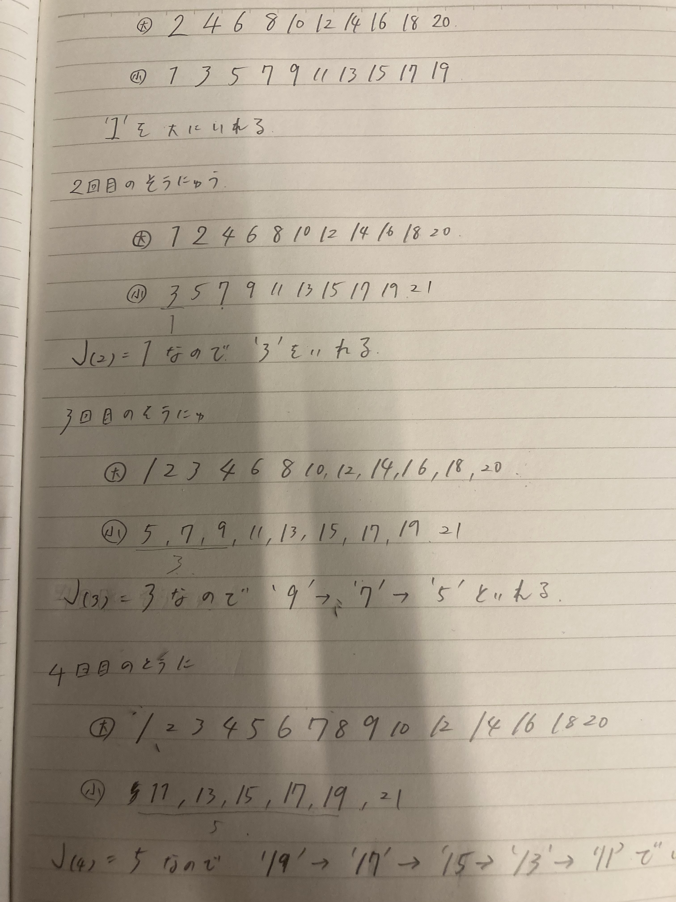

ex02 アルゴリズムの説明

ソート関数に数列が渡される
数列を隣同士でペアにする。
大きい方を大きいリスト
小さい方を小さいリストにいれて
大きいリストをソート関数にぶち込む
昇順に並んだ大きいリストに小さいリストの数を入れていく．

で、小さいリストから大きいリストにどう入れていくのか。

二分探索で入れてく。
ペアを作った時に、大きい方は小さい方の値を持っている。
ペアより小さい数の中で二分探索

1,2,7,5,4,3,14,12のように要素順に入れていったが、
入れる順番は要素順ではなくジャコブスタール数列に従う。

例）

アルゴリズム完成！
ジャコブスタール数列に従うと二分探索の回数が効率化する
多分いい感じで大きい方から入れとくことでちょうどいい感じに中央値が来るようになるのかな